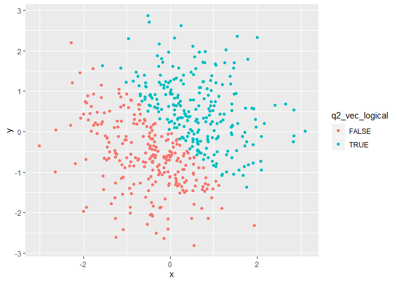
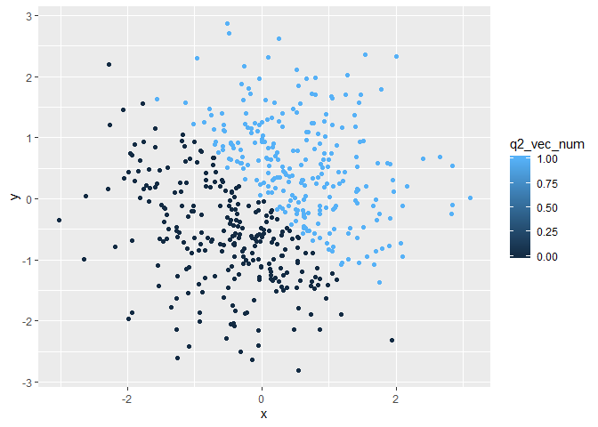

p8105\_hw1\_dd2948
================
David DeStephano
September 15, 2019

Problem 0.2
-----------

This “problem” focuses on correct styling for your solutions to Problems 1 and 2. We will look for:

meaningful variable / object names readable code (one command per line; adequate whitespace and indentation; etc) clearly-written text to explain code and results a lack of superfluous code (no unused variables are defined; no extra library calls; ect)

Problem 1
---------

``` r
library(tibble)
library(tidyverse)
```

    ## -- Attaching packages --------------------------------------------------------------------- tidyverse 1.2.1 --

    ## v ggplot2 3.2.1     v purrr   0.3.2
    ## v tidyr   0.8.3     v dplyr   0.8.3
    ## v readr   1.3.1     v stringr 1.4.0
    ## v ggplot2 3.2.1     v forcats 0.4.0

    ## -- Conflicts ------------------------------------------------------------------------ tidyverse_conflicts() --
    ## x dplyr::filter() masks stats::filter()
    ## x dplyr::lag()    masks stats::lag()

``` r
hw_one_df = tibble(
  random_sample = rnorm(8, sd = 1), 
  vec_logical = random_sample > 0, 
  #check if "True" when greater than 0
  
  vec_char = c("Dave", "Ashley", "Brian", "Luke", "Jackson", "Emma", "Katherine", "Eight"),
  
  vec_factor = factor(c("male", "female", "male", "male", "male", "female", "female", "number" ))
)

mean(pull(hw_one_df, random_sample))
```

    ## [1] -0.2877369

``` r
mean(pull(hw_one_df, vec_logical))
```

    ## [1] 0.375

``` r
mean(pull(hw_one_df, vec_char))
```

    ## Warning in mean.default(pull(hw_one_df, vec_char)): argument is not numeric
    ## or logical: returning NA

    ## [1] NA

``` r
mean(pull(hw_one_df, vec_factor))
```

    ## Warning in mean.default(pull(hw_one_df, vec_factor)): argument is not
    ## numeric or logical: returning NA

    ## [1] NA

You can only get the mean of variables that have numeric values, you can not take a mean for variables are character variables eg:names or classes

Code Chunk 1 CHANGE TO PULL??
=============================

``` r
num_vec_logical <- as.numeric(hw_one_df$vec_logical)
num_vec_char <- as.numeric(hw_one_df$vec_char)
```

    ## Warning: NAs introduced by coercion

``` r
num_vec_factor <- as.numeric(hw_one_df$vec_factor)
```

Code Chunk 2 CHANGE TO PULL?? and naming??
==========================================

``` r
#convert the logical vector to numeric, and multiply the random sample by the result
num_vec_logical2 <- as.numeric(hw_one_df$vec_logical)
num_vec_logical2*hw_one_df$random_sample
```

    ## [1] 0.47463867 0.00000000 0.00000000 0.00000000 0.00000000 0.00000000
    ## [7] 1.23592699 0.08625886

``` r
#convert the logical vector to a factor, and multiply the random sample by the result
num_vec_logical3 <- as.factor(hw_one_df$vec_logical)
num_vec_logical3*hw_one_df$random_sample
```

    ## Warning in Ops.factor(num_vec_logical3, hw_one_df$random_sample): '*' not
    ## meaningful for factors

    ## [1] NA NA NA NA NA NA NA NA

``` r
#NOT MEANINGFUL FOR FACTORS

#convert the logical vector to a factor and then convert the result to numeric, and multiply the random sample by the result
num_vec_logical4 <- as.factor(hw_one_df$vec_logical)
num_vec_logical4 <- as.numeric(num_vec_logical4)
num_vec_logical4*hw_one_df$random_sample
```

    ## [1]  0.9492773 -0.5680725 -0.5298793 -0.9411685 -0.5423329 -1.5172665
    ## [7]  2.4718540  0.1725177

Problem 2
---------

Create a data frame comprised of: x: a random sample of size 500 from a standard Normal distribution y: a random sample of size 500 from a standard Normal distribution A logical vector indicating whether x + y &gt; 1 A numeric vector created by coercing the above logical vector A factor vector created by coercing the above logical vector

``` r
q_2_df = tibble(
  x = rnorm(500, sd = 1),
  y = rnorm(500, sd = 1), 
  q2_vec_logical = x + y > 0,
  q2_vec_num = as.numeric(q2_vec_logical),
  q2_vec_factor = as.factor(q2_vec_logical)
)

nrow(q_2_df)
```

    ## [1] 500

``` r
#There are 500 rows
ncol(q_2_df)
```

    ## [1] 5

``` r
#There are 5 columns

mean(pull(q_2_df, x))
```

    ## [1] -0.04089493

``` r
median(pull(q_2_df, x))
```

    ## [1] -0.008272349

``` r
sd(pull(q_2_df, x))
```

    ## [1] 0.9768168

``` r
#Mean -0.04676723
#Median -0.06674865
#SD 1.013879

#the proportion of cases for which x + y > 1
```

There are 500 rows There are 5 columns The mean is -0.0408949 The median is -0.0082723 The standard deviation is 0.9768168 The proportion of cases in which x+y&gt;1 is 0.464

Plot
====

Make a scatterplot of y vs x; color points using the logical variable (adding color = ... inside of aes in your ggplot code should help). Make a second and third scatterplot that color points using the numeric and factor variables, respectively, and comment on the color scale


