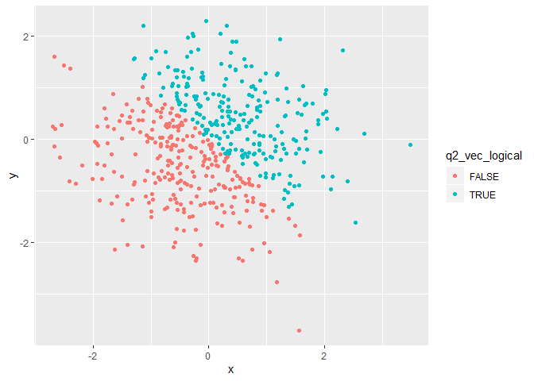
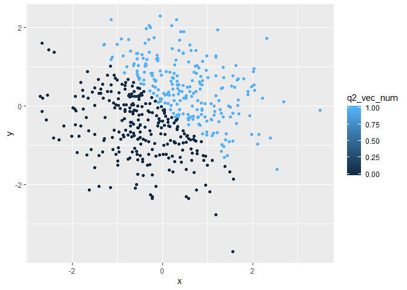

p8105\_hw1\_dd2948
================
David DeStephano
September 15, 2019

Problem 0.2
-----------

This “problem” focuses on correct styling for your solutions to Problems 1 and 2. We will look for:

meaningful variable / object names readable code (one command per line; adequate whitespace and indentation; etc) clearly-written text to explain code and results a lack of superfluous code (no unused variables are defined; no extra library calls; ect)

Problem 1
---------

This code loads the libraries we will need for this project and creates the data frame (using the tibble library) we will need for question one

``` r
library(tibble)
library(tidyverse)
```

    ## -- Attaching packages --------------------------------------------------------------------- tidyverse 1.2.1 --

    ## v ggplot2 3.2.1     v purrr   0.3.2
    ## v tidyr   0.8.3     v dplyr   0.8.3
    ## v readr   1.3.1     v stringr 1.4.0
    ## v ggplot2 3.2.1     v forcats 0.4.0

    ## -- Conflicts ------------------------------------------------------------------------ tidyverse_conflicts() --
    ## x dplyr::filter() masks stats::filter()
    ## x dplyr::lag()    masks stats::lag()

``` r
hw_one_df = tibble(
  random_sample = rnorm(8, sd = 1), 
  vec_logical = random_sample > 0, 
  #check if "True" when greater than 0
  
  vec_char = c("Dave", "Ashley", "Brian", "Luke", "Jackson", "Emma", "Katherine", "Eight"),
  
  vec_factor = factor(c("male", "female", "male", "male", "male", "female", "female", "number" ))
)
```

``` r
mean(pull(hw_one_df, random_sample))
```

    ## [1] -0.03910083

``` r
mean(pull(hw_one_df, vec_logical))
```

    ## [1] 0.375

``` r
mean(pull(hw_one_df, vec_char))
```

    ## Warning in mean.default(pull(hw_one_df, vec_char)): argument is not numeric
    ## or logical: returning NA

    ## [1] NA

``` r
mean(pull(hw_one_df, vec_factor))
```

    ## Warning in mean.default(pull(hw_one_df, vec_factor)): argument is not
    ## numeric or logical: returning NA

    ## [1] NA

You can only get the mean of variables that are stored numerically, you can not take a mean for variables that are character variables. Neither the character or factor vectors work in this code.

Code Chunk 1
============

``` r
num_vec_logical <- as.numeric(hw_one_df$vec_logical)
num_vec_char <- as.numeric(hw_one_df$vec_char)
num_vec_factor <- as.numeric(hw_one_df$vec_factor)
```

The character vector cannot be converted to numeric, because there is no corresponding numeric value that can be applied to character strings. Factor variables and logical variables can both be converted to numeric binary values.

Code Chunk 2
============

``` r
#convert the logical vector to numeric, and multiply the random sample by the result
num_vec_logical2 <- as.numeric(hw_one_df$vec_logical)
num_vec_logical2*hw_one_df$random_sample
```

    ## [1] 0.0000000 0.0000000 0.0000000 0.0000000 0.0000000 1.3306921 2.5979390
    ## [8] 0.6412518

``` r
#convert the logical vector to a factor, and multiply the random sample by the result
num_vec_logical3 <- as.factor(hw_one_df$vec_logical)
num_vec_logical3*hw_one_df$random_sample
```

    ## Warning in Ops.factor(num_vec_logical3, hw_one_df$random_sample): '*' not
    ## meaningful for factors

    ## [1] NA NA NA NA NA NA NA NA

``` r
#NOT MEANINGFUL FOR FACTORS


#convert the logical vector to a factor and then convert the result to numeric, and multiply the random sample by the result
num_vec_logical4 <- as.factor(hw_one_df$vec_logical)
num_vec_logical4 <- as.numeric(num_vec_logical4)
num_vec_logical4*hw_one_df$random_sample
```

    ## [1] -0.7055865 -0.5284294 -0.7544172 -1.5400477 -1.3542087  2.6613842
    ## [7]  5.1958779  1.2825036

Problem 2
---------

Create a data frame comprised of: x: a random sample of size 500 from a standard Normal distribution y: a random sample of size 500 from a standard Normal distribution A logical vector indicating whether x + y &gt; 1 A numeric vector created by coercing the above logical vector A factor vector created by coercing the above logical vector

Creating the data frame:
========================

``` r
q_2_df = tibble(
  x = rnorm(500, sd = 1),
  y = rnorm(500, sd = 1), 
  q2_vec_logical = x + y > 0,
  q2_vec_num = as.numeric(q2_vec_logical),
  q2_vec_factor = as.factor(q2_vec_logical)
)
# 
# nrow(q_2_df)
# #There are 500 rows
# ncol(q_2_df)
# #There are 5 columns
# 
# mean(pull(q_2_df, x))
# median(pull(q_2_df, x))
# sd(pull(q_2_df, x))
# #Mean -0.04676723
# #Median -0.06674865
# #SD 1.013879
# 
# #the proportion of cases for which x + y > 1
```

There are 500 rows

There are 5 columns

The mean is -0.0499518

The median is -0.013287

The standard deviation is 1.0118832

The proportion of cases in which x+y&gt;1 is 0.502

Plot
====

Make a scatterplot of y vs x; color points using the logical variable (adding color = ... inside of aes in your ggplot code should help). Make a second and third scatterplot that color points using the numeric and factor variables, respectively, and comment on the color scale

``` r
 ggplot(q_2_df, aes(x = x, y = y, color=q2_vec_logical)) + geom_point() 
```



``` r
#The color scale could be changed if we wanted, but the default is red and blue for a logical vector
ggsave("scatter_plot.pdf", height = 4, width = 6)

ggplot(q_2_df, aes(x = x, y = y, color=q2_vec_num)) + geom_point() 
```



``` r
#The color scale changes to a gradient because R assums there are values between0 and 1, when 0 and 1 just represent true and false

ggplot(q_2_df, aes(x = x, y = y, color=q2_vec_factor)) + geom_point() 
```


``` r
#The color scale remains the same as the logical vector plot, because there are only two levels in the factor variable
```
